<div align="center">

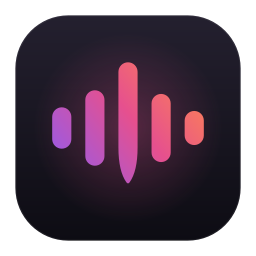

# Tiro

**Hold a key, speak, let go. Your words appear wherever your cursor is.**<br>
Fast, accurate dictation for Windows and Mac that runs entirely on your own computer.

[**Download for Windows**](https://github.com/Min3scon/tiro/releases/latest/download/TiroSetup.exe) ·
[**Download for Mac (Apple Silicon)**](https://github.com/Min3scon/tiro/releases/latest/download/Tiro-mac-arm64.dmg) ·
[Website](https://min3scon.github.io/tiro/) ·
[All releases](https://github.com/Min3scon/tiro/releases)

> **Using Tiro 2.0.2 or older?** [Install the latest version](https://github.com/Min3scon/tiro/releases/latest/download/TiroSetup.exe)
> once (your settings, dictionary and history are kept). From 2.0.3 on, Tiro updates itself.

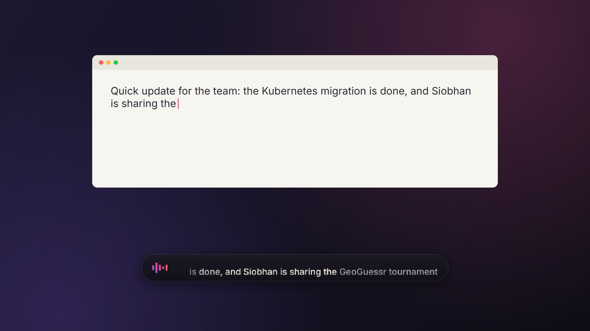

</div>

> **Why "Tiro"?** Marcus Tullius Tiro was Cicero's secretary. To take down Cicero's speeches word for word, he
> invented one of the first shorthand systems. He was, more or less, the original real-time dictation engine.
> The icon is a waveform whose tallest bar ends in a pen nib: voice becoming writing.

---

## Contents

- [What it is](#what-it-is)
- [Features](#features)
- [Install](#install): [Windows](#windows) · [Mac](#mac-apple-silicon)
- [Updates](#updates)
- [Supported hardware](#supported-hardware)
- [How Tiro picks the best setup for your computer](#how-tiro-picks-the-best-setup-for-your-computer)
- [Accuracy: how Tiro gets your words right](#accuracy-how-tiro-gets-your-words-right)
- [Privacy](#privacy)
- [Your words: dictionary and fixes](#your-words-dictionary-and-fixes)
- [Using Tiro](#using-tiro)
- [Troubleshooting](#troubleshooting)
- [Build from source](#build-from-source)
- [Licence and credits](#licence-and-credits)

## What it is

Tiro is a push-to-talk dictation app. It lives in your system tray (Windows) or menu bar (Mac). Hold your dictation key anywhere: in an email, a chat, a code editor or a form. Talk naturally, and
the text streams into the app you're using with punctuation and capitals. A small overlay shows your words as
they're recognised.

Everything happens on your computer. The speech recognition model (NVIDIA's Parakeet TDT, one of the most
accurate open models available), the correction pass and the small AI model that double-checks hard words all run
locally. Nothing you say is sent anywhere.

<div align="center"></div>

## Features

- **Accurate.** Parakeet TDT 0.6B v2 (6% word error rate on the Open ASR leaderboard's English set) with
  punctuation and capitalisation, voice-activity detection, and streaming that keeps up with long dictations.
- **Gets your names right.** A correction pass learns the names, brands and terms *you* use from what you dictate
  and from the fixes you teach it, so "GeoGuessr", "Siobhan" or "Kubernetes" come out the way you write them. See
  [Accuracy](#accuracy-how-tiro-gets-your-words-right).
- **Never rewrites you.** Corrections can only swap a misheard word for one that sounds like it. The rules are
  enforced in code (details below).
- **Fast.** Words are typed while you talk, and the rest lands about 0.05 s after you let go of the key (measured on
  an RTX 3070 into Notepad, a console window and a Chrome text box). The correction pass adds about 0.1 ms in a
  typical commit and under 2 ms at the 95th percentile.
- **Types anywhere.** It types into the focused app, or pastes if you prefer (your clipboard is restored). Smart
  spacing joins dictation onto what you typed, and fillers ("um", "uh") are removed. Say "new line" or
  "new paragraph" for breaks.
- **Hold, toggle or hands-free.** Hold the key to talk; double-tap to keep dictating hands-free. Esc cancels.
- **Fix last transcription.** Press <kbd>Ctrl</kbd>+<kbd>Alt</kbd>+<kbd>F</kbd>, correct the word, and Tiro
  remembers the fix from then on.
- **A real installer.** It checks your CPU, GPU, graphics memory and RAM, picks the fastest setup, explains why in
  plain English, runs a real speed test and lets you try dictating before you finish.
- **Private by design.** No accounts, no telemetry, no cloud. It never learns from password fields.
- **Updates itself, safely.** New versions download in the background, are checked against a signed list, and install
  the next time Tiro starts. If one doesn't start properly, Tiro goes back to the version you had.

## Install

### Windows

1. Download **[TiroSetup.exe](https://github.com/Min3scon/tiro/releases/latest/download/TiroSetup.exe)** (2 MB) and
   run it. No administrator rights needed: Tiro installs for your user only.
2. Setup checks your PC and recommends the graphics card (NVIDIA) or the processor, with an estimate for each. It
   downloads Tiro, NVIDIA's GPU libraries (only if you have a supported NVIDIA card) and the speech model.
   Downloads resume if your connection drops, and every file is checked against its SHA-256 before use.
3. It tests speech recognition on a real recording and shows you the result.
4. Tiro opens its own short setup. It fetches and benchmarks its AI helper, then you pick your microphone and
   shortcut, choose whether it learns from what you say, add any special words, and dictate a test sentence.

| 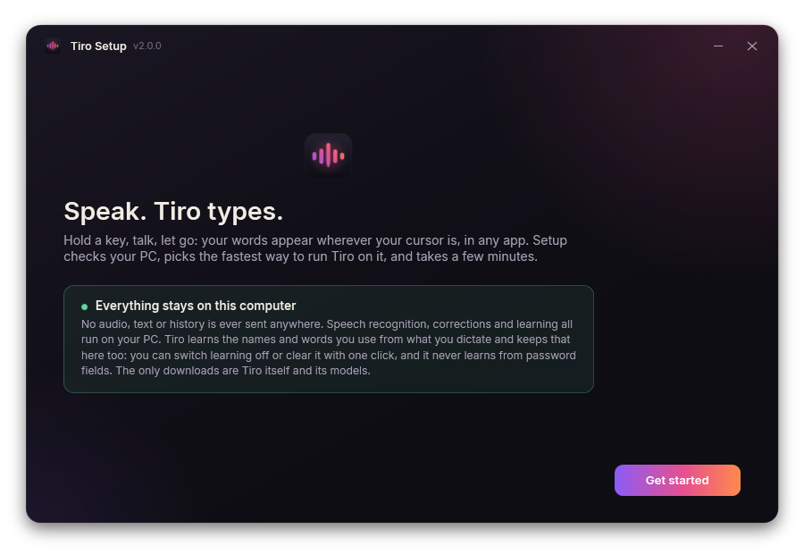 | 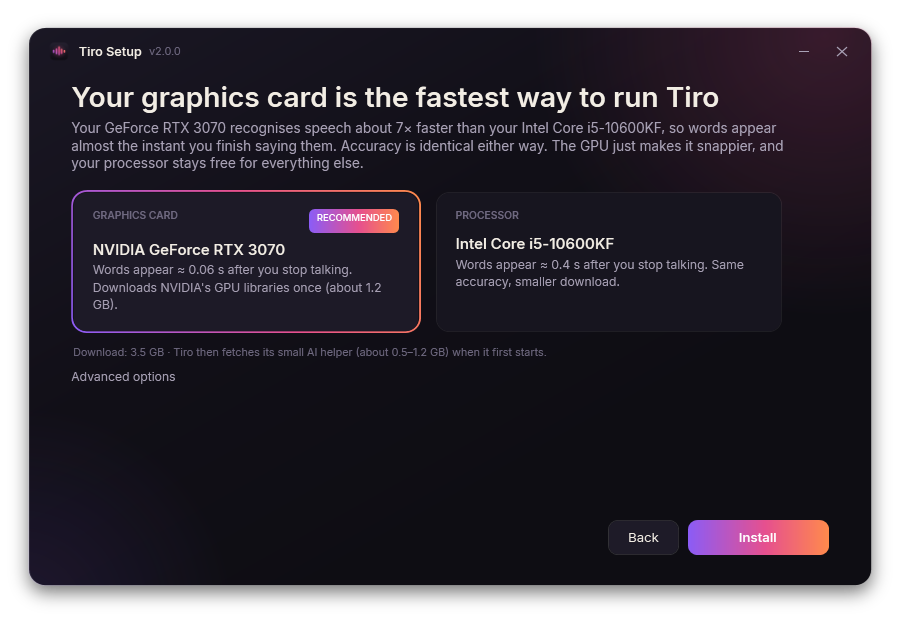 |
|---|---|
| 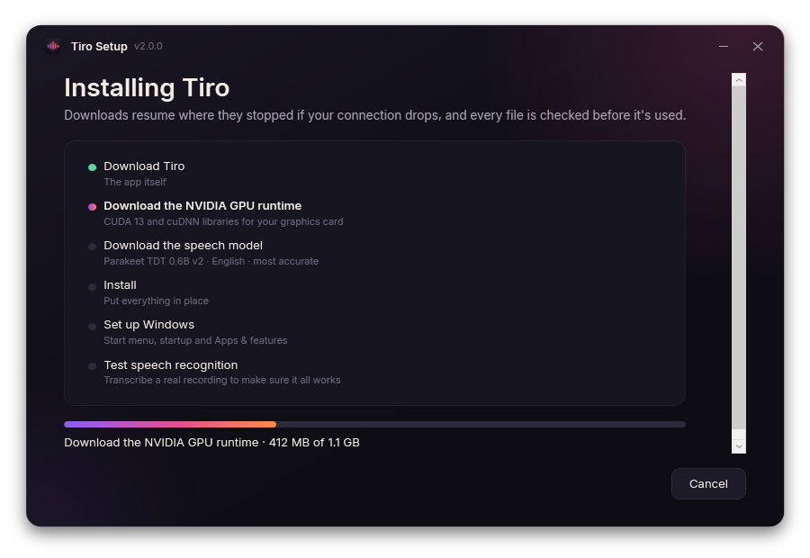 | 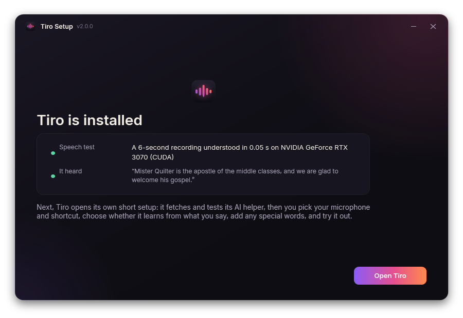 |

Windows 10 (1803 or newer) or Windows 11, 64-bit. Prefer a portable copy? Download `Tiro-<version>-app-win64.zip`
from the [release](https://github.com/Min3scon/tiro/releases), unzip it anywhere and run `Tiro.exe`. Its setup
downloads the models, plus NVIDIA's GPU libraries if your card can use them.

Uninstall from **Settings → Apps → Tiro**. You can choose to keep or delete your settings and history.

### Mac (Apple Silicon)

Tiro for Mac needs a Mac with Apple Silicon (M1, M2, M3, M4 or newer) and macOS 13 Ventura or later.
**Intel Macs are not supported.**

1. Download **[Tiro-mac-arm64.dmg](https://github.com/Min3scon/tiro/releases/latest/download/Tiro-mac-arm64.dmg)**,
   open it, and drag **Tiro** into **Applications**.
2. **First launch (Gatekeeper).** Tiro is free and open source and isn't signed with a paid Apple Developer ID, so
   macOS blocks it the first time. To open it:
   - Open **Applications** and double-click **Tiro**. macOS says it can't verify the app. Click **Done** (or
     **Cancel**).
   - Open **System Settings → Privacy & Security**, scroll down to the message *"Tiro" was blocked to protect your
     Mac*, click **Open Anyway**, then confirm with your password or Touch ID.
   - On macOS 14 and earlier you can instead **right-click** (or Control-click) Tiro in Applications, choose
     **Open**, and click **Open** in the dialog.
   - If macOS says the app is "damaged", remove the download quarantine in Terminal and open it again:
     ```bash
     xattr -dr com.apple.quarantine /Applications/Tiro.app
     ```
   You only need to do this once.
3. Tiro appears in the **menu bar** (no Dock icon). Its setup walks you through three permissions, each with a
   button that opens the right page in System Settings:
   - **Microphone**, to hear you;
   - **Accessibility**, to type into the app you're using;
   - **Input Monitoring**, to notice your dictation key while another app is in front.
   If typing doesn't work after you've allowed these, quit Tiro from its menu and open it again.
4. The default key is **Right Option (⌥)**. Hold it and speak.

> **Can't see the icon?** On MacBooks with a notch, menu bar icons that don't fit are hidden behind the notch.
> Hold <kbd>⌘ Command</kbd> and drag icons you don't need out of the menu bar (or move Tiro further right), or
> quit a few menu bar apps. You can also open Tiro's settings from Launchpad: opening Tiro again while it's
> running shows its settings.

## Updates

From version 2.0.3, Tiro on Windows keeps itself up to date:

- It checks for a new version about two minutes after it starts and then every few hours, **never while you're
  dictating**, and not on a metered connection unless you allow it.
- It downloads **only the files that changed** (an update to Tiro's own code is about 10 MB, not the 1.3 GB a full
  install with GPU support takes) and checks every file against a list
  signed by the release pipeline. Anything that doesn't match is thrown away.
- The new version is installed **next to** the current one and takes over the next time Tiro starts (or click
  **Restart to update**). If it doesn't start properly twice, Tiro goes back to the version you had and won't try that
  one again. **Settings → Updates → Go back** returns to the previous version at any time.
- **What a check sends:** only Tiro's version, your Windows or macOS version and your processor type (in the
  request's User-Agent), like any download. No account, no ID, nothing you said or typed.
- **Settings → Updates** shows the status and lets you switch automatic checks off (then Tiro never goes online
  unless you click **Check now**), choose the Stable or Beta channel, and allow downloads on metered connections.
- **Safe mode:** hold **Shift** while starting Tiro to start it with the extras off (corrections, learning, GPU). It
  also starts that way by itself if it failed to start twice in a row.
- Windows may show a SmartScreen warning for new downloads because Tiro isn't code-signed yet; updates installed by
  Tiro itself don't go through SmartScreen.

On a Mac, Tiro tells you when a new version is out and opens its download page; you install it by dragging the new
app to Applications, as the first time. (Automatic updates on a Mac need an Apple Developer ID, which Tiro doesn't
have yet: without it, macOS would ask for the microphone and accessibility permissions again after every update.)
Phones and tablets don't have a Tiro app.

## Supported hardware

| Computer | Speech recognition runs on | AI check | Words appear after you stop talking* |
|---|---|---|---|
| Windows + NVIDIA RTX 20-series or newer (≥ 4 GB VRAM), driver 580+ | GPU (CUDA 13) | Qwen2.5 1.5B on the GPU (6 GB+ VRAM), else 0.5B | ≈ 0.05–0.1 s |
| Windows + older NVIDIA (GTX 10-series), AMD or Intel graphics | Processor | Qwen2.5 0.5B on the processor, if the speed check passes | ≈ 0.3–1 s |
| Mac with Apple Silicon (M1 or newer), macOS 13+ | The chip's CPU cores, with the compact int8 model (see note) | Qwen2.5 1.5B on the GPU (MLX) | ≈ 0.1–0.6 s |
| Intel Mac | not supported | — | — |

\*For a typical phrase. Text streams while you talk, so long dictations don't wait until the end.

At least 8 GB of RAM is recommended. Disk space: about 1.5 GB for a processor setup, about 5 GB with an NVIDIA GPU
(most of it NVIDIA's libraries). AMD and Intel graphics aren't accelerated yet, so on those PCs Tiro uses the
processor, which keeps up with real-time dictation.

> **Mac note:** the Mac build is compiled and smoke-tested on GitHub's Apple Silicon (M1) machines. There, the
> compact int8 speech model on the CPU cores understood 6 seconds of speech in about 0.6 s. That was faster than
> running it through Core ML, which either failed to compile this model or was 3–10× slower. Core ML is still
> available as an experimental option. The AI check runs on the GPU with MLX, at about 150–250 ms per check on that
> virtual machine. A real Mac has more cores and a faster GPU, and Tiro's speed check measures yours during setup.

## How Tiro picks the best setup for your computer

You never have to guess what "CUDA" means. The installer (Windows) and the first-run setup (both platforms) do this:

1. **Detect.** Your operating system, processor (cores, AVX2/AVX-512), memory, graphics card (through the NVIDIA
   driver: model, graphics memory, compute capability, driver version), or Apple chip.
2. **Decide.** An NVIDIA RTX 20-series or newer with a recent driver and at least 4 GB of graphics memory runs speech
   on the GPU (about ten times faster than a processor, and it keeps your PC responsive). Otherwise the processor runs
   it, using the compact int8 edition of the model with the same accuracy. If the GPU isn't usable, Setup says why
   ("your driver is too old: update to 580 or newer") and links to the fix. On a Mac, speech runs on the Apple chip's
   CPU cores (measured faster than Core ML for this model) and the AI check on its GPU.
3. **Explain** it in plain English, with an estimated delay for each option ("Words appear ≈ 0.06 s after you stop
   talking"). The other option is one click away, and an **Advanced** section lets you choose the folder, the
   language model (English, or 25 European languages), startup and a desktop shortcut.
4. **Measure.** After installing, a real speed test transcribes a recording and times the correction pass with the AI
   check. If the AI check can't answer within the 150 ms limit, Setup tries the smaller model. If that's still too
   slow, it switches the AI check off, tells you so, and keeps your dictionary and history corrections on.

<table><tr>
<td>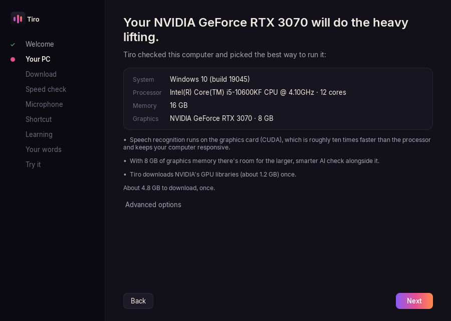</td>
<td>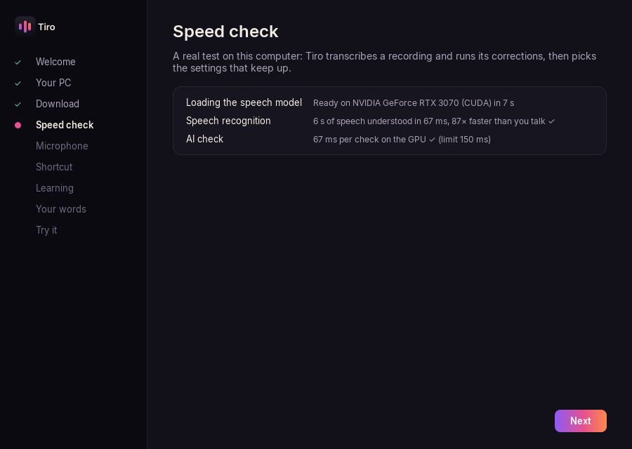</td>
</tr></table>

## Accuracy: how Tiro gets your words right

Speech recognisers are very good at ordinary English and weaker on rare words: your colleague's name, the game you
play, your company's product. Tiro targets that last few per cent without rewriting what you said.

### 1. A strong recogniser, steered toward your words

Parakeet TDT 0.6B v2 does the recognition. While it decodes, words from your dictionary and fixes you've taught
are *boosted*: once the decoder starts spelling one of them, continuing it gets a bonus. That turns
"Geo Guesser" into "GeoGuessr" at the source. Every word also carries a confidence score from the model.

### 2. A correction pass, in tiers, cheapest first

| Tier | What it does | Cost |
|---|---|---|
| **0: quick check** | Confident, ordinary words (and words you use) pass straight through. Most sentences stop here. | microseconds |
| **1: your vocabulary** | For doubtful words, sound-alike candidates come from your dictionary, fixes you taught, your dictation history and a built-in list of about 2,800 names, brands, places, games and terms. Lookups use precomputed sound-key and spelling indexes. Each candidate is checked **against the audio** by the recogniser's own decoder, which re-reads the same audio as the candidate and scores how well it fits. It's then weighed by how strongly *you* use that word (how often, in which apps, and next to which words). | ~1–3 ms on a GPU |
| **2: AI check** (optional) | When the evidence is close, a small local language model (Qwen2.5 1.5B or 0.5B) scores each candidate sentence and "keep what you said" in context, with a few of your own past sentences as examples. It can only pick between those options. It never writes text. | ~65 ms on an RTX 3070, ~200 ms on a CPU |

How it stays fast:
- Tier 1 and 2 work runs **while you're still talking**, on the partial transcript, so it's usually finished
  before the words are ready to type.
- The AI model stays loaded. Its fixed instructions are processed once and cached, and all candidates are scored
  in one batched pass.
- It shares the GPU politely: the speech model always goes first.
- There's a hard deadline (150 ms by default). If a check would be late, the words are typed as heard. A late
  correction is swapped in afterwards only if you haven't typed, clicked or switched windows since, and only if
  it's a clean in-place edit.
- Every commit is timed. If corrections ever make typing late, Tiro steps down by itself (smaller AI model →
  checks fewer words → AI check off) and tells you what it changed.

### 3. Learning what you say

- **History.** Tiro keeps your past dictations locally and builds a profile: word and name frequencies, how you
  spell and capitalise each one ("Rust" the language vs "rust" on a car), which words appear together, and in
  which apps. So the same ambiguous audio can come out differently for two people, the way each of them means it.
- **Fix last transcription** (<kbd>Ctrl</kbd>+<kbd>Alt</kbd>+<kbd>F</kbd>, or the tray/menu): correct the
  misheard word once. Tiro stores the fix and applies it next time as a plain lookup, with no guessing.
- **Retyped words.** If you backspace over a word Tiro just typed and type a similar-sounding one, Tiro learns that
  too. You can switch this off.

You can see, edit, delete and export everything Tiro has learned in **Settings → Dictionary & learning**.

### The rules: Tiro never rewrites you

The correction pass may **only swap out a word or a short span (up to three words) that was likely misheard**.
It never rephrases, rewords, reorders, adds or removes words, summarises, fixes your grammar, tidies your slang
or changes your tone. These rules are enforced in code, in `tiro/correct/corrector.py`, not just written in a prompt:

- Every proposed change goes through a **validator**. It checks that the span matches what was recognised, has no
  punctuation inside it, and is replaced by at most three words. A run-together word may be split in two; no other
  word may be added.
- **Both** conditions must hold. (a) The new word must look or sound like what was heard: spelling and phonetic
  similarity (using the CMU Pronouncing Dictionary for real pronunciations), or a strong fit to the audio.
  (b) It must be backed by evidence: your dictionary, a fix you taught, your history, or the starter list.
  Otherwise the change is dropped.
- A strong audio mismatch **vetoes** a candidate outright, whatever else supports it.
- The output is **rebuilt** from the recognised words plus the validated swaps, then checked word for word against
  the original outside those spans. If anything else differs, the whole correction is discarded.
- Ordinary words the recogniser was sure of ("cloud", "jury", "apple") need context or the AI check to agree before
  they can change. Brand names made of ordinary words ("drop box", "among us") need the AI check to clearly agree.
- When unsure, it leaves your words alone. You can make it bolder or more careful (**Strict / Balanced /
  Aggressive**) and set the confidence threshold in **Settings → Accuracy**.

<table><tr>
<td>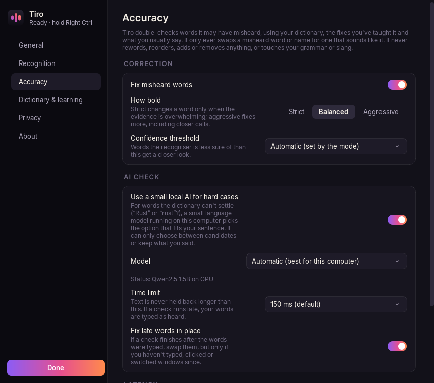</td>
<td>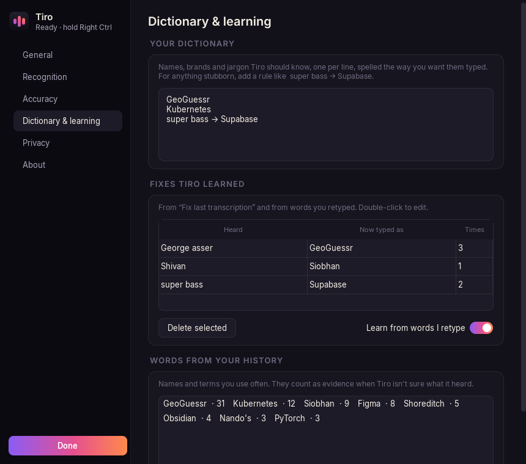</td>
</tr></table>

### Results

Measured with [`dev/accuracy.py`](dev/accuracy.py) on synthesized speech from three voices (US and UK accents) on
an RTX 3070. The full report, with every sentence, is in [`tests/accuracy/REPORT.md`](tests/accuracy/REPORT.md).

**Tricky phrases.** 72 sentences across 9 categories: games, apps and brands, tech, people, places, slang,
homophones, split and merged words, numbers and acronyms. The "with your words" row is a user who has these terms
in their dictionary or history.

| Setup | Word error rate | Tricky terms exactly right |
|---|---|---|
| Recogniser alone | 9.9% | 208 / 375 |
| With the correction pass, out of the box | 8.4% | 244 / 375 |
| With the correction pass and your words | **6.3%** | **286 / 375** |

**Same audio, different history.** For 13 ambiguous sentences (Rust/rust, Shaun/Sean, Teams/teams, Claude/cloud,
Swift/SWIFT, Lyft/lift, Sydney/Sidney, ...), each spoken by 3 voices, Tiro chose the reading that matched the
user's history in **75 of 78** runs.

**Do no harm.** Across 270 ordinary sentences (everyday speech, slang, odd phrasing, common names, numbers) × 3
voices, the correction pass changed a word that was already right in **0 of 810** sentences. It also fixed 4
genuine misrecognitions.

**Speed.** At the end of speech, the correction pass adds **0.1 ms** (median) and **1.9 ms** (95th percentile)
before the last words are typed, against targets of 30 ms and 150 ms. With nothing prepared in advance, the worst
case, it's 12.2 ms at the 95th percentile.

## Privacy

**Everything stays on your device. No audio, text or history is sent anywhere.**

- Speech recognition, correction, the AI check and learning all run locally. Tiro has no account, no telemetry and
  no analytics.
- Your dictation history is stored only on your computer: `%LOCALAPPDATA%\Tiro\history.db` on Windows,
  `~/Library/Application Support/Tiro/history.db` on a Mac. Learning from it can be **switched off** in
  **Settings → Privacy**, and history can be **cleared with one click**.
- Tiro **never learns from, saves or corrects text dictated into password fields** or anything else marked
  secure. On Windows it checks for password edit boxes and UI Automation's *IsPassword* flag; on a Mac, macOS's
  secure input mode and secure text fields. If it can't tell, it doesn't learn.
- Logs never contain what you dictate.
- The only network traffic is downloading Tiro and its models (from GitHub and Hugging Face) during setup, and the
  update check (see [Updates](#updates): it sends only Tiro's version, your Windows or macOS version and processor type). You
  can switch automatic update checks off in **Settings → Updates**.

<div align="center">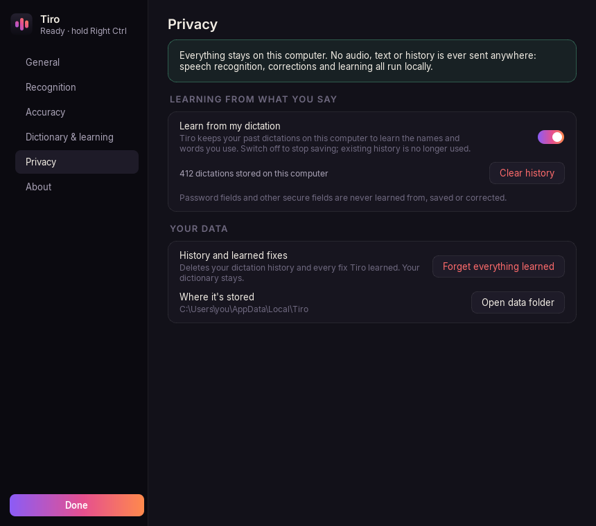</div>

## Your words: dictionary and fixes

- **Settings → Dictionary & learning → Your dictionary**: one word or name per line, spelled the way you want it
  typed: `Siobhan`, `GeoGuessr`, `Kubernetes`. Tiro boosts these while recognising and treats them as strong
  evidence when correcting.
- For something stubborn, write a rule: `super bass -> Supabase`. Rules apply as plain lookups.
- **Fix last transcription** (<kbd>Ctrl</kbd>+<kbd>Alt</kbd>+<kbd>F</kbd>) opens your last dictation. Fix the
  word and press Enter. If you haven't typed since, Tiro also replaces it in the app; otherwise it copies the
  corrected text for you.
- Everything learned is listed under **Fixes Tiro learned** and **Words from your history**, where you can edit,
  delete or export it (JSON or CSV).

<div align="center">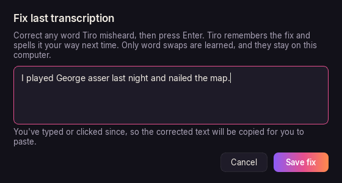</div>

## Using Tiro

| Action | Windows | Mac |
|---|---|---|
| Dictate | Hold **Right Ctrl**, speak, release | Hold **Right Option ⌥**, speak, release |
| Hands-free (long dictation) | Double-tap the key, speak, tap once to finish | same |
| Cancel | **Esc** while dictating | same |
| Toggle mode | Settings → Mode → *Press to toggle* | same |
| Fix last transcription | **Ctrl + Alt + F** | **⌃ Control + ⌥ Option + F** |
| Line breaks | Say "new line" or "new paragraph" | same |

- The key is swallowed while you dictate, so apps never see it. Shortcuts that use it (Right Ctrl + C) still work.
- Change the key to anything you don't type with: F-keys, Caps Lock, Right Alt/Option, fn, or a combination.
- The tray / menu bar menu has the same items on both platforms: status, Start/Stop dictation, Fix last
  transcription, Copy last dictation, Microphone, Custom dictionary, Add word, mode, Start with Windows / Launch at
  login, Settings, Check for updates and Quit. On a Mac the icon fills in while you're dictating.

## Troubleshooting

| Problem | What to do |
|---|---|
| Nothing is typed | Click into a text field first. On Windows, apps running as administrator need Tiro to run as administrator too (Settings → About). On a Mac, check Accessibility and Input Monitoring in System Settings → Privacy & Security, then reopen Tiro. |
| "No sound from the microphone" | Pick another input in the tray / menu bar → Microphone. Settings → General → Microphone → **Test** shows a live level meter. |
| The first word gets cut off | Settings → General → **Instant start** keeps the microphone open so nothing is missed. |
| Slow on a laptop GPU / CPU | Setup's speed check picks settings that keep up. You can also switch the AI check to the smaller model or off in Settings → Accuracy; Settings → Accuracy → **Show latency details** shows the real numbers. |
| GPU not used | Settings → Recognition says why (for example, a driver older than 580). Update the NVIDIA driver and restart Tiro. |
| A name keeps coming out wrong | Use **Fix last transcription** once, or add it to your dictionary. |
| Tiro changed a word it shouldn't have | Undo it, use Fix last transcription to put it back (Tiro learns that too), or set Settings → Accuracy → **Strict**. Please also [open an issue](https://github.com/Min3scon/tiro/issues). |
| Mac: "Tiro can't be opened" | See the [Gatekeeper steps](#mac-apple-silicon). |
| Logs | Settings → About → Open log folder (`%LOCALAPPDATA%\Tiro\logs` or `~/Library/Logs/Tiro`). They never contain your dictation. |

## Build from source

Requirements: Python 3.13, [uv](https://github.com/astral-sh/uv) (or pip). For the Windows installer you also need
the .NET SDK 8+.

```bash
git clone https://github.com/Min3scon/tiro && cd tiro
uv venv && uv pip install -r requirements-windows.txt      # or requirements-mac.txt on an Apple Silicon Mac
python -m tiro --setup                                      # downloads the models, then the setup wizard
python -m pytest                                            # unit tests (no models needed)
```

Windows release (app, GPU runtime pack and installer): `powershell -File tools\build.ps1`. Mac app and dmg:
`bash tools/build_mac.sh`. GitHub Actions builds both and attaches them to a release whenever a `v*` tag is pushed
(see `.github/workflows/release.yml`).

Layout: `tiro/` is the app. `tiro/correct/` holds the correction pass, `tiro/platform/` the Windows and macOS
layers, and `tiro/ui/` the overlay, tray, settings and setup wizard. `installer/` is the Windows installer (WPF),
`site/` the website, and `tests/` the unit tests plus the accuracy test sets in `tests/accuracy/`. `dev/` contains
the evaluation and benchmarking scripts.

## Licence and credits

Tiro is released under the [MIT licence](LICENSE).

- Speech recognition: [NVIDIA Parakeet TDT 0.6B](https://huggingface.co/nvidia/parakeet-tdt-0.6b-v2) (CC-BY-4.0),
  via [onnx-asr](https://github.com/istupakov/onnx-asr) and [ONNX Runtime](https://onnxruntime.ai/).
- Voice activity detection: [Silero VAD](https://github.com/snakers4/silero-vad) (MIT).
- AI check: [Qwen2.5 Instruct](https://huggingface.co/Qwen) 0.5B / 1.5B (Apache-2.0); ONNX builds by
  onnx-community, MLX builds by mlx-community.
- Word lists: [wordfreq](https://github.com/rspeer/wordfreq) (CC-BY-SA 4.0) and the
  [CMU Pronouncing Dictionary](https://github.com/cmusphinx/cmudict) (BSD). See `assets/words/LICENSE.txt`.
- Interface font: [Inter](https://rsms.me/inter/) (OFL). UI: [Qt for Python](https://www.qt.io/qt-for-python).
- Test audio in `tests/data/dummy` is from [LibriSpeech](https://www.openslr.org/12) (CC-BY-4.0).
